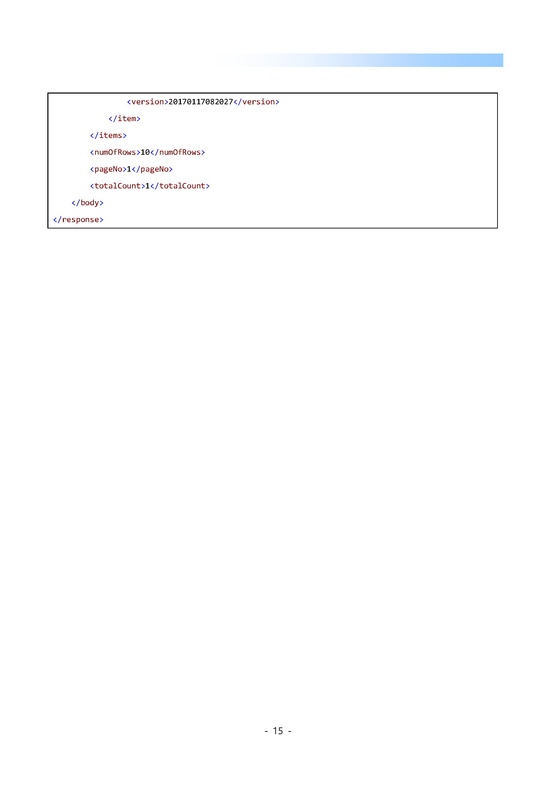
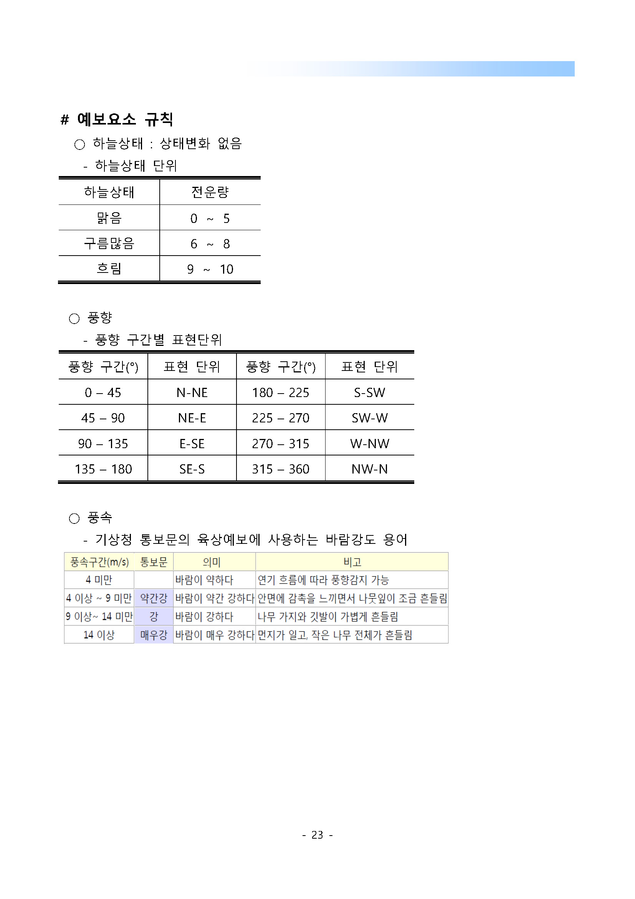
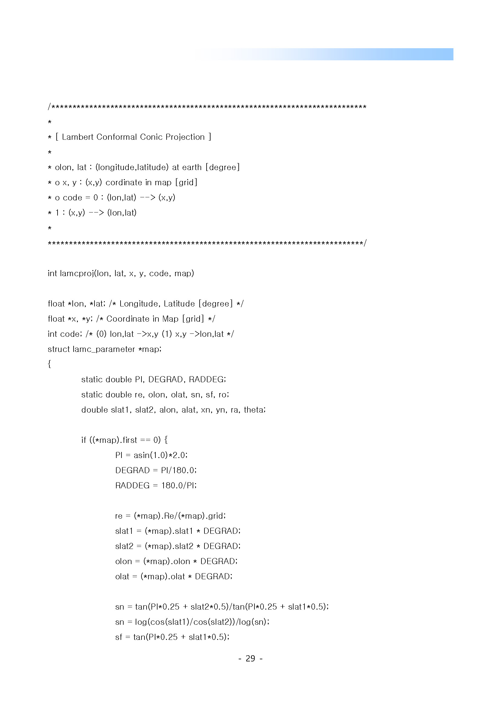

# venv 세팅
```shell
> python3.8 -m venv venv
```
또는  
```shell
> python -m venv venv
```
>>>
### 윈도우10  
```
> venv\\Scripts\activate.bat
```
### 리눅스/맥
```
> ./venv/Scripts/activate
```

### 모듈 설치
- 반드시 venv 실행된 상태에서 진행해야함.
```
(venv)> pip install requests
```

---
# 날씨 정보 조회 서비스
- 참조 URL https://www.data.go.kr/iim/api/selectAPIAcountView.do
- 위 사이트에서 제공하는 doc 문서 상세히 읽어봐야 함.

### 메인 모듈
> python3 oepn_weather.py 
  
### 동네예보 주요 코드


### 동네예보 base_time 안내

  

### 동네예보 가이드 문서 전체 보기











